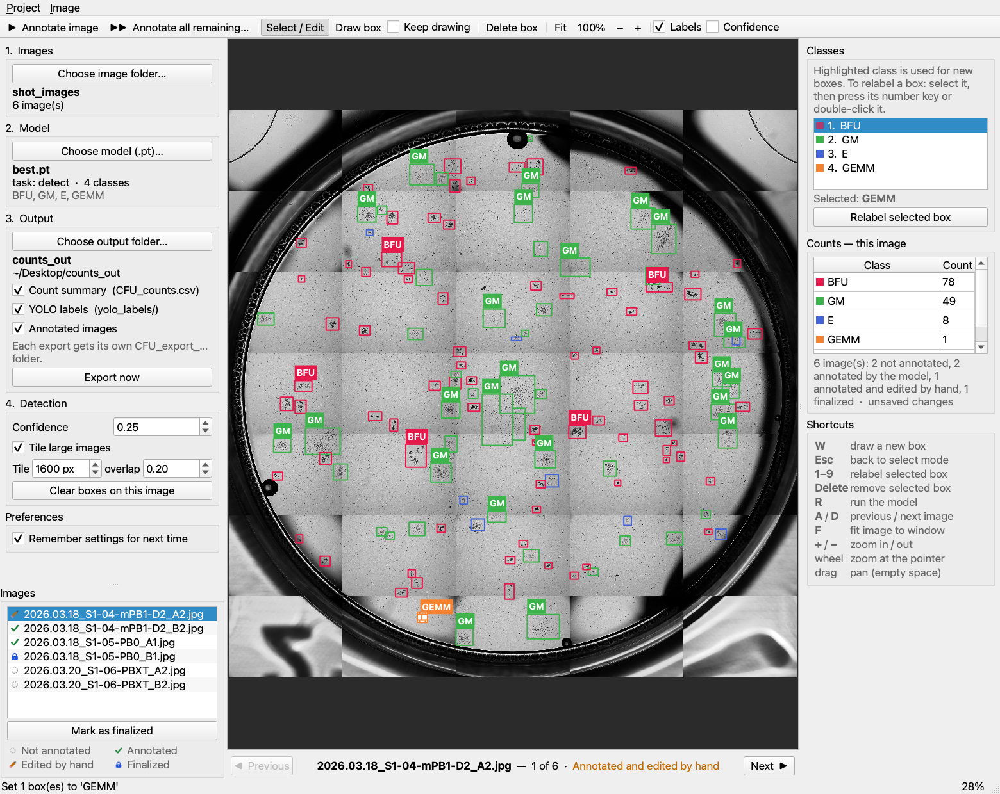

# CFU Annotator

A desktop app for counting hematopoietic CFUs. It runs a YOLO detection model
over a folder of plate photos, draws a labelled box around every colony it
finds, lets you correct those boxes by hand, and exports the counts.

No programming needed — everything is buttons and menus.



Work is saved as a **project** you can reopen later, and every image carries a
status — annotated, edited by hand, or finalized — shown in the image list.

---

## Starting the app

**Double-click `CFU Annotator.app`** (in `dist/` after a build — see
[Building the standalone app](#building-the-standalone-app)). It's a normal Mac
application: no Terminal, no Python installation, no scripts. Drag it to
`/Applications` or the Dock if you like.

> **First launch: "cannot be opened because it is from an unidentified developer"**
> The app isn't signed with an Apple developer certificate, so macOS blocks it
> the first time. Right-click it → **Open** → **Open** in the dialog. macOS
> remembers the choice; every later launch is a plain double-click.
>
> If macOS instead says the app "is damaged and can't be opened" (this happens
> when the app has been copied from another machine, e.g. via email or a shared
> drive), clear the quarantine flag once:
>
> ```bash
> xattr -dr com.apple.quarantine "/Applications/CFU Annotator.app"
> ```

Two other ways to start it, both needing the project's Python environment:

- Double-click `Launch CFU Annotator.command` in the `annotator` folder. A
  Terminal window opens, checks the required packages (offering to install
  anything missing), and starts the app. Leave that window open while you work.
- From a terminal:

```bash
cd "/Users/mzhai72/Desktop/SC-RNA Seq/CFU-classifier/annotator" && ../.venv/bin/python -m cfu_annotator
```

---

## Using it

The window has three parts: **setup steps and the image list on the left**, the
**image in the middle**, and **classes, live counts, and shortcuts on the
right**. The two Annotate buttons are in the toolbar along the top.

### 1. Choose the image folder

Click **Choose image folder…** and pick the folder holding your plate photos.
A normal Finder dialog opens, so you can navigate to the folder as usual.

- Only `.jpg`, `.jpeg` and `.png` files are used.
- Anything that isn't an image (spreadsheets, `.DS_Store`, notes) is ignored
  silently.
- Images in a format the app can't open (`.tif`, `.bmp`, `.webp`, …) trigger a
  warning that lists them, so you know which plates were left out. Convert
  those to JPEG or PNG if you need them counted.
- Only the folder itself is read — images in subfolders are **not** picked up.

The first image appears as soon as the folder loads, and **every** image in the
folder is listed in the panel below the setup steps. Click any row to jump
straight to that image — no need to arrow through them one at a time. Each row
carries an icon showing where that image stands:

| Icon | Status | Set by |
|---|---|---|
| ○ dotted circle | Not annotated | — |
| ✓ green tick | Annotated | the model, automatically |
| ✏️ pencil | Annotated and edited by hand | you, on any change to a box |
| 🔒 blue padlock | Finalized | you, when you're happy with the image |

"Edited" appears as soon as you draw, move, resize, delete, or relabel a box.
Re-running the model on an image resets it to plain "annotated", since the boxes
are the model's again.

**Finalized** is yours to set: select an image and click **Mark as finalized**
(or press ⌘L). It means "these annotations are done", and to make that
meaningful the app then protects them — the boxes can't be drawn, moved,
deleted, or relabelled, and neither *Annotate image* nor *Annotate all
remaining* will overwrite them. A badge on the image says so. Click the same
button (now reading **Finalized — click to unlock**) to make changes again.

### 2. Choose the model

Click **Choose model (.pt)…** and pick a trained YOLO weights file. For this
project that's `nuc/best.pt` (or any `runs/detect/.../weights/best.pt`).

The app reads everything it needs from the file itself — the model
architecture, and the class names it was trained on. The sidebar then shows the
class list (for `nuc/best.pt`: `BFU`, `GM`, `E`, `GEMM`), and those names become
the columns of the exported summary.

Only **detection** models are supported, since counting needs a box per colony.
Pick a classification, segmentation, pose, or rotated-box (OBB) model and the
app says so and declines to load it.

### 3. Choose the output folder and formats

Click **Choose output folder…**, then tick what you want written:

| Option | Output | Default |
|---|---|---|
| **Count summary** | `CFU_counts.csv` | on |
| **YOLO labels** | `yolo_labels/` | off |
| **Annotated images** | `annotated_images/` | on |
| *(always)* | `export_info.txt` | — |

Nothing is written loose into the folder you chose. Each export creates its own
dated folder inside it:

```
counts_out/                          ← the folder you chose
├── CFU_export_2026-08-07_1642/      ← one export
│   ├── CFU_counts.csv
│   ├── export_info.txt
│   ├── yolo_labels/
│   └── annotated_images/
└── CFU_export_2026-08-07_1710/      ← a later export, untouched by the first
```

Re-exporting therefore never overwrites numbers you have already used, and two
exports in the same minute get a `-2` suffix rather than colliding.

**Annotated images** are full-resolution copies of each annotated plate with the
boxes and labels drawn on (`plate1.jpg` → `plate1_annotated.jpg`), for checking
counts without opening the app. They're the slowest and bulkiest part of an
export — a 10400 × 10752 plate takes about a second and lands at roughly 25 MB,
so a 40-plate experiment adds around a gigabyte. It runs with a progress bar and
a working Cancel; untick the box to skip it.

`CFU_counts.csv` has one row per image and one column per class:

```
image,BFU,GM,E,GEMM,total,status
plate1.jpg,78,49,8,0,135,annotated
plate2.jpg,71,48,6,0,125,annotated
plate3.jpg,0,0,0,0,0,not_annotated
```

Every image in the folder gets a row. The `status` column carries the same four
states as the image list (`not_annotated` / `annotated` / `edited` /
`finalized`), so a row of zeros is never ambiguous — you can tell a plate with
genuinely no colonies from one you never got to, and which counts a human has
checked.

`export_info.txt` is written every time you export, without being asked for. It
records how the numbers were produced:

```
CFU Annotator — export record
============================================================

Exported          : 2026-07-27 15:41:08
App version       : 1.1.1
Project file      : /Users/you/Desktop/CFU counts/March 2026.cfuproj

MODEL
------------------------------------------------------------
File              : /Users/you/…/CFU-classifier/nuc/best.pt
Type              : YOLO detect
Classes           : BFU, GM, E, GEMM

DETECTION PARAMETERS
------------------------------------------------------------
    Confidence threshold : 0.25
    Tiling               : on
    Tile size            : 1600 px
    Tile overlap         : 0.2
    Applied to           : 42 image(s)
…
```

The detection parameters are read back from the images themselves, not from
whatever the controls happen to say at export time. If you changed the
confidence part-way through a session, the file lists every set of settings that
was actually used and which plates each one produced — so a spreadsheet of
counts is always traceable to the run that made it.

`yolo_labels/` holds one `.txt` per annotated image in standard YOLO format
(`class_id centre_x centre_y width height`, normalised 0–1) plus a
`classes.txt`. That folder can be opened directly in labelImg or imported into
CVAT, and is the format to use if you want to feed corrected annotations back
into training.

Nothing is written until you click **Export now** (or press ⌘S). If the files
already exist, the app asks before overwriting them.

### 4. Annotate

**Annotate this image** (or press `R`) runs the model on the plate on screen.
Boxes appear with a coloured label per class, and the counts panel on the right
updates immediately.

**Annotate all remaining…** runs the model over every image not yet annotated.
Progress is shown per tile, and **Cancel** stops it — everything already
finished is kept.

#### About tiling

Whole-plate photos are enormous (6400×6400 and larger) while colonies are tiny.
Feeding the whole frame to the model shrinks the colonies past the point of
being detectable, so by default the app slices each image into overlapping
1600 px tiles, runs the model on each at native resolution, and merges the
results — the same approach used to train this model and to serve it to CVAT.

Leave **Tile large images** ticked unless your images are already small.
Tile size and overlap are adjustable, and images smaller than one tile are
processed in a single pass automatically.

---

## Correcting the annotations

The model gets most colonies right, but not all. Editing works like
labelImg/CVAT:

| To do this | Do that |
|---|---|
| Select a box | Click it |
| Move a box | Drag its middle |
| Resize a box | Drag one of the eight white handles |
| Draw a new box | Press `W`, then drag on the image |
| Draw several in a row | Tick **Keep drawing** in the toolbar first |
| Change a box's class | Select it, press its number key (`1`–`4`), or double-click it for a menu |
| Delete a box | Select it, press `Delete` |
| Zoom | Scroll wheel (zooms where the pointer is), or `+` / `−` |
| Fit to window | Press `F` |
| Pan | Drag empty space, or hold Space and drag |
| Next / previous image | `D` / `A`, the buttons under the image, or click a row in the image list |
| Jump to any image | Click its row in the image list |
| Mark an image complete | **Mark as finalized**, or ⌘L |

After you draw a box the tool returns to **Select / Edit** on its own, so the
next click edits rather than drawing another box by accident. If you're adding
several colonies in a row, tick **Keep drawing** in the toolbar and the tool
stays put until you press `Esc`.

Boxes you draw or edit are indistinguishable from the model's own in the export,
and edits stick when you move between images. The class highlighted in the
right-hand list is the one new boxes get; relabelling an existing box is always
explicit, so choosing what to draw next can't silently change a box you already
have selected.

---

## Saving your work

Counting 40 plates is not a single sitting, so the app has **projects**. A
project remembers everything: the three folders, the model, the detection
settings, every box on every image, and each image's status.

| Menu item | Shortcut | |
|---|---|---|
| **Project → Save project** | ⌘S | Save; asks for a filename the first time |
| **Project → Open project…** | ⌘O | Pick up exactly where you left off |
| **Project → New project** | ⌘N | Start fresh |
| **Project → Save project as…** | ⇧⌘S | Save a copy |

Projects are single `.cfuproj` files — put one next to your images or wherever
you keep the experiment. The window title shows the project name, with a `•`
while there are unsaved changes, and the app offers to save before you quit,
open another project, or switch image folders. Saving is atomic, so a crash
part-way through can't corrupt a project you already had.

Boxes are stored in image pixel coordinates, not tied to any folder path, so a
project survives having its images moved: point it at the new folder and
everything lines up. If images have gone missing or new ones have appeared since
the project was saved, opening it says so rather than quietly losing work — and
a project still opens (annotations editable) even if the model file has moved,
because the class names are saved too.

**Saving a project is not the same as exporting.** Saving preserves your work in
progress; exporting writes the spreadsheet. Do both.

---

## Remembering your setup

**Remember settings for next time** (bottom of the left panel, or the Project
menu) is on by default. With it ticked, the app reopens with the same image
folder, model, output folder, detection settings, export choices and view
toggles you last used — so a repeat session starts with one click instead of
five.

It remembers *settings*, never annotations: the images come back listed as not
annotated. Your boxes live in a project file, which you save deliberately.
Untick the box to stop remembering and clear anything already stored.

---

## Notes

- Nothing is ever written to your image folder — the app only reads from it.
- The image folder isn't watched for changes; re-pick it if you add files.
- Only one model at a time: loading a model whose class names differ from the
  ones your existing boxes were made with gets you a warning, since the boxes
  keep their class *numbers*.

## Building the standalone app

`CFU Annotator.app` is produced by PyInstaller, which packages Python, Qt, torch
and ultralytics into one self-contained bundle — the machine that runs it needs
nothing installed. You only need to rebuild after changing the code in `cfu_annotator/`.

### Step 1 — install PyInstaller (once)

It is already installed in this project's `.venv`. Check with:

```bash
cd "/Users/mzhai72/Desktop/SC-RNA Seq/CFU-classifier/annotator" && ../.venv/bin/python -m PyInstaller --version
```

That should print a version number such as `6.21.0`. A `WARNING: Assuming this
is not an Anaconda environment…` line above it is harmless — this `.venv` is
built on Anaconda's Python and PyInstaller always says so.

If the command errors instead, install it:

```bash
cd "/Users/mzhai72/Desktop/SC-RNA Seq/CFU-classifier/annotator" && ../.venv/bin/python -m pip install pyinstaller
```

### Step 2 — build

```bash
cd "/Users/mzhai72/Desktop/SC-RNA Seq/CFU-classifier/annotator" && ../.venv/bin/python build_app.py
```

Takes about 2–3 minutes. Any previous build is removed first, so this is also
how you rebuild after editing the code. Output:

```
dist/CFU Annotator.app        the app (~1.5 GB; torch is most of it)
build_pyinstaller/            scratch files, safe to delete
```

Both are gitignored — never commit them.

### Step 3 — the build checks itself

When the build finishes it launches the bundle's own self-test, which confirms
that inside the bundle Qt starts, the window builds, torch and ultralytics
import, and a real `.pt` model loads and runs a detection. You should see:

```
SELF-TEST: OK
The bundled app passed its self-test.
```

If it says `FAILED`, the bundle is broken and must not be distributed — the
named step tells you what's missing. To re-check a build without rebuilding:

```bash
cd "/Users/mzhai72/Desktop/SC-RNA Seq/CFU-classifier/annotator" && ../.venv/bin/python build_app.py --verify-only
```

### Step 4 — try it, then share it

Double-click `dist/CFU Annotator.app`. To hand it to someone else, zip it and
put it on a shared drive (it's far too big to email). Because it isn't signed
with an Apple developer certificate, whoever receives it needs the right-click →
**Open** step, or the `xattr -dr com.apple.quarantine` command shown at the top
of this file. Signing and notarising with a paid Apple Developer account would
remove that step.

### Building a Windows .exe

PyInstaller can only build for the platform it runs on, so a `.exe` **cannot** be
produced on this Mac. The same recipe works on Windows — copy this folder to a
Windows machine with Python 3.12 installed, then:

```bash
py -m pip install -r requirements.txt pyinstaller && py build_app.py
```

That produces `dist\CFU Annotator\CFU Annotator.exe`. Nothing in the app is
macOS-specific, but the Windows build has not been tested here.

### If you edit the build recipe

The build is driven by `CFU_Annotator.spec`. Two things in it matter:

- ultralytics' package data must be collected (`collect_all`) — it loads yaml
  model configs at runtime, so modules alone aren't enough.
- `excludes` must never list a *submodule* of torch (e.g. `torch.testing`).
  torch imports those itself, and the partial import leaves its C extensions
  half-registered. The bundle then builds cleanly and dies on launch with
  `cannot initialize type "RpcBackendOptions"`. Only exclude whole packages.

## For developers

| File | Purpose |
|---|---|
| `main.py` | Entry point (`python -m cfu_annotator`), dependency check, `--selftest` |
| `mainwindow.py` | Window layout, pickers, wiring, export flow |
| `canvas.py` | `ImageCanvas` / `BoxItem` — display and interactive editing |
| `detector.py` | Model loading + validation, tiled inference, NMS merge |
| `project.py` | `.cfuproj` save/load |
| `status.py` | The four per-image statuses and their drawn icons |
| `render.py` | Drawing boxes onto exported image copies |
| `settings.py` | Remembering the last-used setup (QSettings) |
| `../tests/test_canvas_geometry.py` | Regression tests for the canvas geometry contract (in `annotator/tests/`) |

Run every check with:

```bash
cd "/Users/mzhai72/Desktop/SC-RNA Seq/CFU-classifier/annotator" && ../.venv/bin/python tests/run_all.py
```

`tests/test_core.py` covers scanning, model validation, the export files and
projects; `tests/test_ui.py` drives the window with real mouse events;
`tests/test_canvas_geometry.py` guards the crash described below.

### One rule to keep in mind when editing `canvas.py`

`BoxItem.boundingRect()` and `BoxItem.shape()` must depend **only** on the box's
own rect — never on the view or its zoom level. QGraphicsScene caches those rects
in its spatial index, and `QGraphicsView::scale()` dispatches a synthetic
mouse-move *while* the transform is being applied, so an item whose bounds have
silently changed gets looked up in a stale index and the process segfaults inside
`QGraphicsScene::mouseMoveEvent`. That was the 1.1.0 wheel-zoom crash.

Anything that must stay a constant size on screen — the selection handles, the
class labels, the FINALIZED badge — is drawn by the view in `drawForeground()` in
device coordinates, and hit-tested there. Keep it that way.

## Version history

| Version | Change |
|---|---|
| 1.2.0 | Exports go into their own dated folder; annotated images can be exported; the draw tool returns to Select after each box; settings are remembered between launches |
| 1.1.1 | Fixed a crash when zooming with the scroll wheel on an annotated image |
| 1.1.0 | Projects, image list with per-image status, export log, bundled `.app` |
| 1.0.0 | First version |
| `workers.py` | `QThread`s for model loading and inference |
| `scan.py` | Folder scanning and image-format triage |
| `export.py` | CSV summary and YOLO label writing |

Built on PyQt5 and Ultralytics; both are already in `../.venv`. The tiling and
merge logic mirrors `../nuc/model_handler.py`, which serves the same model to
CVAT — so counts from the app and from CVAT auto-annotation agree.
